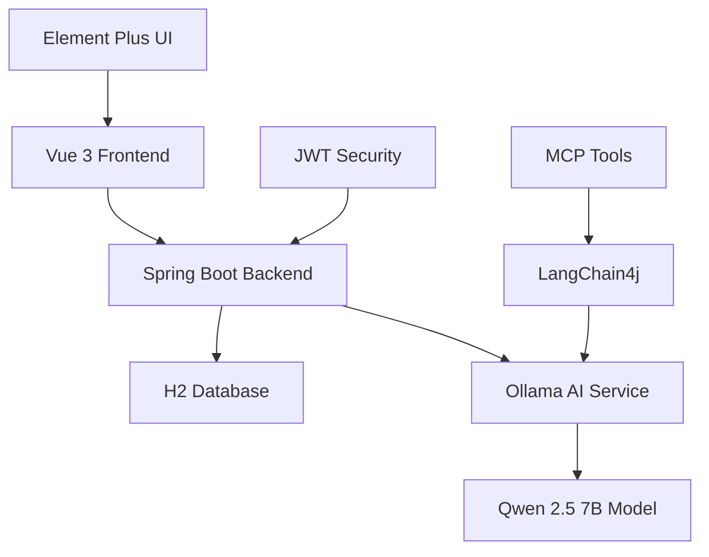

# 智能訂單管理系統 (Intelligent Order Management System)


**Copyright (c) 2025 Etrex Kuo. All rights reserved.**

> 🏆 **Hackathon 專案** - 完全地端部署的智能訂單管理系統，整合最新 AI 技術

## 🌟 專案特色

### 📋 完整功能
- ✅ **前端**: Vue 3 + TypeScript + Element Plus
- ✅ **後端**: Spring Boot 3 + Java 17 + H2 Database
- ✅ **AI 整合**: Ollama + Qwen 2.5 7B + LangChain4j
- ✅ **身份管理**: JWT + Spring Security + 角色權限
- ✅ **API 文件**: Swagger/OpenAPI 3.0
- ✅ **資料庫**: Flyway 版控 + 事件溯源

### 🤖 AI 智能客服
- 🗣️ 自然語言對話（繁體中文）
- 🔧 MCP 工具調用（Tool Calling）
- 📦 商品查詢與推薦
- 📊 訂單狀態追蹤
- 📱 響應式聊天介面

### 🛡️ 企業級安全
- 🔐 JWT Token 認證
- 👥 Admin/Customer 角色分離
- 🛡️ Spring Security 防護
- 📝 完整操作記錄

## 🚀 快速開始

### 1️⃣ 安裝 AI 模型
```bash
./setup-ollama.sh
```

### 2️⃣ 啟動系統
```bash
./startup.sh
```

### 3️⃣ 開始使用
- 🌐 前端: http://localhost:5173
- 📚 API 文件: http://localhost:8080/api/swagger-ui.html
- 🗄️ 資料庫: http://localhost:8080/api/h2-console

## 🔑 測試帳號

| 身份 | 帳號 | 密碼 |
|------|------|------|
| 管理員 | `admin` | `password` |
| 顧客 | `customer1` | `password` |

## 🏗️ 技術架構



### 前端技術棧
- **Vue 3** - 現代化漸進式框架
- **TypeScript** - 類型安全
- **Element Plus** - 企業級 UI 組件
- **Pinia** - 現代狀態管理
- **Vite** - 極速構建工具

### 後端技術棧
- **Spring Boot 3** - 企業級 Java 框架
- **Spring Security** - 安全認證框架
- **Spring JPA** - 資料持久化
- **Flyway** - 資料庫版控
- **H2 Database** - 內嵌式資料庫

### AI 技術棧
- **Ollama** - 本地 LLM 運行環境
- **Qwen 2.5 7B** - 阿里雲通義千問模型
- **LangChain4j** - Java AI 應用框架
- **MCP** - 模型上下文協議

## 📊 功能模組

### 🛍️ 商品管理
- 商品 CRUD 操作
- 庫存管理
- 搜尋與分頁
- 上下架控制

### 📦 訂單系統
- 訂單建立與管理
- 付款流程
- 出貨狀態追蹤
- 取消與退款

### 🤖 智能客服
- 自然語言理解
- 動態工具調用
- 商品推薦
- 訂單查詢

### 👥 用戶管理
- JWT 認證
- 角色權限控制
- 會話管理

## 📈 資料庫設計

### 核心實體
- **Users** - 用戶資料（Admin/Customer）
- **Products** - 商品資料
- **Orders** - 訂單主表
- **OrderItems** - 訂單明細
- **Payments** - 付款記錄
- **OrderEvents** - 事件溯源

## 🔧 開發指南

### 後端開發
```bash
cd backend
mvn spring-boot:run
```

### 前端開發
```bash
cd frontend
npm run dev
```

### AI 服務
```bash
ollama serve
ollama run qwen2.5:7b
```

## 📝 API 文件

完整 REST API 文件請訪問：
👉 http://localhost:8080/api/swagger-ui.html

### 主要端點
- `POST /auth/login` - 用戶登入
- `GET /products` - 商品列表
- `POST /orders` - 建立訂單
- `POST /chat/message` - AI 對話

## 🧪 測試

### 後端測試
```bash
cd backend
mvn test
```

### 前端測試
```bash
cd frontend
npm run test
```

## 📱 螢幕截圖

### 登入頁面
- 支援 Admin/Customer 角色切換
- 現代化設計風格

### 商品管理
- 響應式列表設計
- 搜尋與分頁功能

### 智能客服
- 浮動聊天窗口
- 實時 AI 對話

## 🎯 專案亮點

### 🏆 技術創新
- 完全地端 AI 解決方案
- 現代化微服務架構
- 響應式設計

### 💡 商業價值
- 降低雲端成本
- 保護資料隱私
- 提升用戶體驗

### 🚀 擴展性
- 模組化設計
- API 優先
- 容器化就緒

## 📄 授權聲明

本專案所有程式碼均屬 **Etrex Kuo** 個人版權所有。

## 🤝 技術支援

如有技術問題，請參考：
- 📚 [專案指南](PROJECT_GUIDE.md)
- ⚙️ [安裝說明](SETUP_INSTRUCTIONS.md)
- 🔧 API 文件 (Swagger UI)

---

**🎉 恭喜完成智能訂單管理系統部署！**

Made with ❤️ by Etrex Kuo | Powered by 🤖 Qwen 2.5