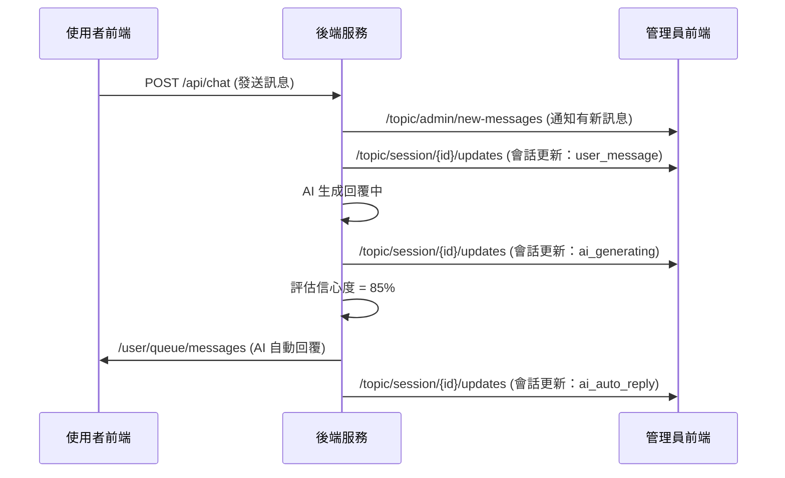
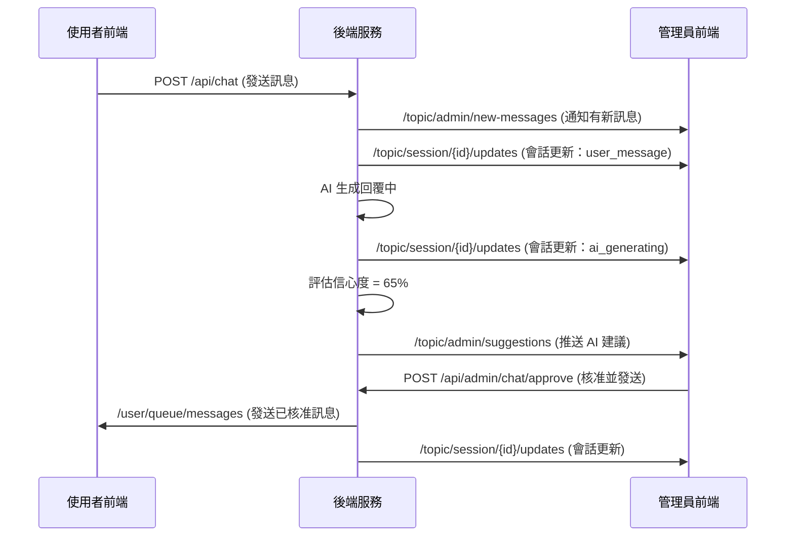
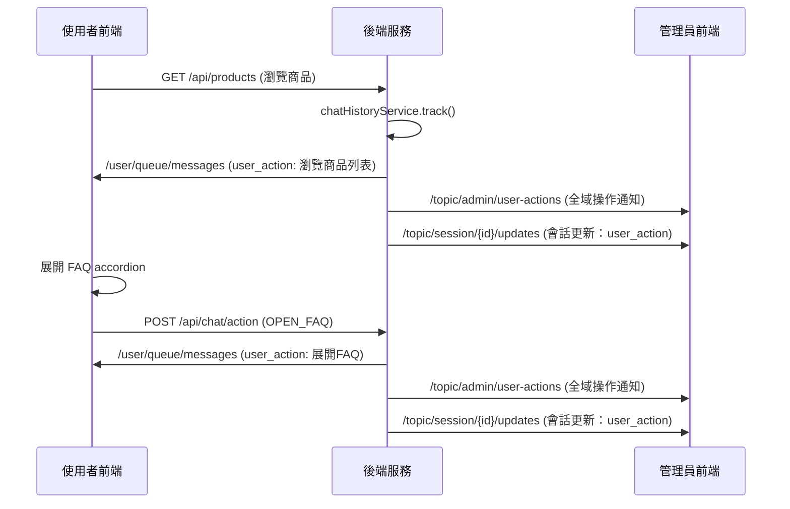

# WebSocket 即時通訊架構設計

## 概述

本系統使用 **Spring WebSocket** + **STOMP 協議** 實現即時雙向通訊，支援客戶與 AI 助手的即時對話、管理員監控、以及 AI 建議推送等功能。

## 技術棧

### 後端
- **Spring WebSocket**: Spring Framework 的 WebSocket 支援
- **STOMP**: Simple Text Oriented Messaging Protocol，提供訊息路由機制
- **SimpMessagingTemplate**: Spring 的訊息發送模板，負責推送通知

### 前端
- **@stomp/stompjs**: STOMP 客戶端實作
- **SockJS**: WebSocket fallback 機制，確保舊瀏覽器相容性

## 連線端點

```
ws://localhost:8080/ws/chat
```

- 使用 **SockJS** 包裝，支援 WebSocket、HTTP Streaming、HTTP Long Polling 等多種傳輸方式
- 客戶端連線時需在 `connectHeaders` 中附上 JWT token：
  ```javascript
  connectHeaders: {
    Authorization: `Bearer ${token}`
  }
  ```

## 訂閱頻道架構

### 頻道類型說明

系統使用三種頻道類型：

1. **`/queue/*`**: 點對點通道（單一使用者）
2. **`/user/{userId}/queue/*`**: 使用者專屬通道（Spring 自動路由）
3. **`/topic/*`**: 廣播通道（任何訂閱者都能收到）

### 1. 使用者專屬頻道 (User Channels)

#### `/user/queue/messages`

**目的**: 推送訊息給特定使用者

**誰能訂閱**:
- 任何已登入的使用者
- 使用者只能訂閱自己的頻道（由 Spring Security Principal 控制）

**傳遞資訊**:
```typescript
{
  messageType: string,    // 訊息類型
  content: string,        // 訊息內容
  messageId: number,      // 訊息 ID
  timestamp: number       // 時間戳
}
```

**messageType 類型**:
- `"ai_auto"`: AI 自動回覆（confidence >= 80%）
- `"admin"`: 管理員手動回覆
- `"ai_approved"`: 管理員核准的 AI 建議
- `"user_action"`: 使用者自己的操作記錄

**使用場景**:
1. AI 高信心度自動回覆時，直接推送給使用者
2. 管理員發送訊息給特定使用者
3. 管理員核准 AI 建議後，發送給使用者
4. 使用者執行操作後，即時顯示操作記錄在自己的對話框

**後端發送方式**:
```java
chatNotificationService.notifyUser(
    userId,           // 使用者 ID
    "ai_auto",        // 訊息類型
    "回覆內容",        // 內容
    messageId         // 訊息 ID
);
```

**前端訂閱方式**:
```typescript
await subscribeToUserMessages(userId, (message) => {
  // 處理接收到的訊息
  console.log(message.content)
})
```

---

### 2. 管理員廣播頻道 (Admin Broadcast Channels)

#### `/topic/admin/new-messages`

**目的**: 通知所有管理員有新的使用者訊息

**誰能訂閱**:
- 僅限 ADMIN 角色
- 前端應在管理員登入後自動訂閱

**傳遞資訊**:
```typescript
{
  sessionId: string,      // 會話 ID (使用者 ID)
  userId: number,         // 使用者 ID
  userName: string,       // 使用者名稱
  message: string,        // 訊息內容
  messageId: number,      // 訊息 ID
  timestamp: number       // 時間戳
}
```

**使用場景**:
- 使用者發送新訊息時，即時通知所有在線的管理員
- 管理員後台顯示未讀訊息數量
- 管理員可點擊通知快速進入該使用者的對話頁面

**後端發送方式**:
```java
chatNotificationService.notifyAdminsNewMessage(
    sessionId,        // 會話 ID
    userId,           // 使用者 ID
    userName,         // 使用者名稱
    message,          // 訊息內容
    messageId         // 訊息 ID
);
```

**前端訂閱方式**:
```typescript
await subscribeToAdminNewMessages((notification) => {
  // 更新未讀訊息列表
  sessions.value.find(s => s.id === notification.sessionId)?.unreadCount++
})
```

---

#### `/topic/admin/suggestions`

**目的**: 通知管理員需要審核的 AI 建議

**誰能訂閱**:
- 僅限 ADMIN 角色

**傳遞資訊**:
```typescript
{
  aiResponseId: number,       // AI 回覆 ID
  sessionId: string,          // 會話 ID
  userId: number,             // 使用者 ID
  suggestedText: string,      // AI 建議的回覆內容
  confidence: number,         // 信心度分數 (0.4-0.8)
  createdAt: string,          // 建立時間
  // 其他可能的 metadata
}
```

**使用場景**:
- AI 信心度介於 40%-80% 時，建議交由管理員審核
- 管理員可選擇：
  1. **核准並發送**：直接發送給使用者
  2. **修改後發送**：編輯後再發送
  3. **拒絕**：不使用此建議，手動回覆

**信心度分級**:
- **>= 80%**: 自動發送，不需審核
- **40%-80%**: 建議審核，推送到此頻道
- **< 40%**: 不推送建議，等待管理員手動處理

**後端發送方式**:
```java
chatNotificationService.notifyAdminsSuggestion(suggestion);
```

**前端訂閱方式**:
```typescript
await subscribeToAdminSuggestions((suggestion) => {
  // 顯示 AI 建議對話框
  showSuggestionDialog(suggestion)
})
```

---

#### `/topic/admin/user-actions`

**目的**: 通知管理員使用者的所有操作行為

**誰能訂閱**:
- 僅限 ADMIN 角色

**傳遞資訊**:
```typescript
{
  sessionId: string,        // 會話 ID
  userId: number,           // 使用者 ID
  userName: string,         // 使用者名稱
  actionType: string,       // 操作類型
  actionTarget: string,     // 操作目標
  timestamp: number         // 時間戳
}
```

**actionType 類型**:
- `"API_CALL"`: 後端 API 呼叫（所有業務操作）
- `"NAVIGATE"`: 頁面導航
- `"CLICK"`: 按鈕點擊
- `"SUBMIT"`: 表單提交
- `"OPEN_MODAL"`: 開啟彈窗
- `"CLOSE_MODAL"`: 關閉彈窗
- `"OPEN_FAQ"`: 展開 FAQ

**使用場景**:
- 管理員即時監控使用者在網站上的所有操作
- 了解使用者行為路徑，提供更精準的客服支援
- 結合對話記錄，理解使用者提問的上下文

**後端發送方式**:
```java
chatNotificationService.notifyAdminsUserAction(
    sessionId,        // 會話 ID
    userId,           // 使用者 ID
    userName,         // 使用者名稱
    "API_CALL",       // 操作類型
    "瀏覽商品列表"     // 操作描述
);
```

**前端訂閱方式**:
```typescript
await subscribeToAdminUserActions((action) => {
  // 在使用者列表中顯示最新操作
  updateUserLastAction(action.userId, action.actionTarget)
})
```

---

### 3. 會話頻道 (Session Channels)

#### `/topic/session/{sessionId}/updates`

**目的**: 推送特定會話的所有更新給正在監控該會話的管理員

**誰能訂閱**:
- 管理員進入特定使用者的對話頁面時訂閱
- 離開頁面時取消訂閱

**傳遞資訊**:
```typescript
{
  type: string,              // 更新類型
  content: string,           // 內容
  messageId?: number,        // 訊息 ID (可選)
  confidence?: number,       // AI 信心度 (可選)
  aiResponseId?: number,     // AI 回覆 ID (可選)
  timestamp: number          // 時間戳
}
```

**type 類型**:
- `"user_message"`: 使用者發送新訊息
- `"user_action"`: 使用者執行操作
- `"ai_generating"`: AI 正在生成回覆中
- `"ai_auto_reply"`: AI 已自動回覆（含信心度）

**使用場景**:
1. 管理員開啟特定使用者的對話頁面
2. 即時看到該使用者的所有動態：
   - 發送的訊息
   - 執行的操作（點擊、導航等）
   - AI 回覆狀態（生成中 / 已完成）
   - AI 自動回覆的內容和信心度

**後端發送方式**:
```java
// 一般更新
chatNotificationService.notifySessionUpdate(
    sessionId,
    "user_message",
    messageContent,
    messageId
);

// AI 自動回覆（含信心度）
chatNotificationService.notifySessionUpdateWithAiInfo(
    sessionId,
    aiResponse,
    messageId,
    confidence,
    aiResponseId
);
```

**前端訂閱方式**:
```typescript
// 進入對話頁面時訂閱
const subscription = await subscribeToSessionUpdates(sessionId, (update) => {
  if (update.type === 'ai_generating') {
    showAiGeneratingIndicator()
  } else if (update.type === 'ai_auto_reply') {
    addMessageToChat(update.content)
  }
  // ... 處理其他類型
})

// 離開頁面時取消訂閱
onUnmounted(() => {
  subscription.unsubscribe()
})
```

---

## 認證機制

### JWT Token 驗證

WebSocket 連線使用與 REST API 相同的 JWT 認證機制：

1. **前端連線時**，在 `connectHeaders` 中附上 token：
   ```javascript
   connectHeaders: {
     Authorization: `Bearer ${token}`
   }
   ```

2. **後端攔截器** `WebSocketAuthInterceptor` 驗證 token：
   ```java
   @Component
   public class WebSocketAuthInterceptor implements ChannelInterceptor {
       @Override
       public Message<?> preSend(Message<?> message, MessageChannel channel) {
           // 從 header 中提取 JWT token
           // 驗證 token 並設定 Principal
       }
   }
   ```

3. **權限控制**：
   - Spring Security 會自動檢查 Principal 的角色
   - `/user/queue/messages` 只能訂閱自己的頻道
   - `/topic/admin/*` 只有 ADMIN 角色能訂閱

---

## 完整運作流程

### 場景 1: 使用者發送訊息，AI 自動回覆



**步驟說明**:
1. 使用者在前端發送訊息
2. 後端接收後，立即通知所有管理員有新訊息
3. 後端通知監控該會話的管理員：使用者已發送訊息
4. AI 開始生成回覆，推送「生成中」狀態給管理員
5. AI 完成生成，信心度評估為 85%（>= 80%）
6. 自動發送給使用者（`/user/queue/messages`）
7. 同時通知管理員該會話的 AI 自動回覆狀態

---

### 場景 2: AI 信心度中等，建議管理員審核



**步驟說明**:
1. 使用者發送訊息
2. 後端通知管理員有新訊息
3. AI 生成回覆，信心度為 65%（40%-80% 區間）
4. 後端推送 AI 建議給所有管理員（`/topic/admin/suggestions`）
5. 管理員審核後核准
6. 發送給使用者並更新會話狀態

---

### 場景 3: 使用者操作追蹤



**追蹤機制**:

1. **後端自動追蹤**（API 呼叫）:
   - 控制器中呼叫 `chatHistoryService.track()`
   - 範例：`track(user, "瀏覽商品列表")`
   - 用於所有業務 API 呼叫（GET/POST/PUT/DELETE）

2. **前端手動追蹤**（UI 互動）:
   - 前端呼叫 `chatApi.recordAction('OPEN_FAQ', description)`
   - 用於不觸發 API 的 UI 互動（accordion 展開、modal 開關等）

**通知對象**:
- 使用者自己：即時在對話框看到操作記錄
- 所有管理員：了解所有使用者的操作動態
- 監控該會話的管理員：看到特定使用者的操作

---

## 前端實作範例

### 使用者端（Chatbot.vue）

```typescript
import { useChatWebSocket } from '@/composables/useChatWebSocket'

const { subscribeToUserMessages } = useChatWebSocket()

onMounted(async () => {
  // 訂閱使用者專屬訊息
  await subscribeToUserMessages(userId, (message) => {
    const messageType = message.messageType || message.type

    if (messageType === 'user_action') {
      // 顯示操作記錄（灰色樣式）
      messages.value.push({
        content: message.content,
        type: 'action',
        timestamp: Date.now()
      })
    } else {
      // 顯示 AI/管理員回覆（白色氣泡）
      messages.value.push({
        content: message.content,
        type: 'bot',
        timestamp: Date.now()
      })
    }

    scrollToBottom()
  })
})
```

### 管理員端（ChatManagement.vue）

```typescript
import { useChatWebSocket } from '@/composables/useChatWebSocket'

const {
  subscribeToAdminNewMessages,
  subscribeToAdminSuggestions,
  subscribeToAdminUserActions,
  subscribeToSessionUpdates
} = useChatWebSocket()

onMounted(async () => {
  // 1. 訂閱所有新訊息
  await subscribeToAdminNewMessages((notification) => {
    // 更新使用者列表未讀數
    updateUnreadCount(notification.sessionId)

    // 顯示系統通知
    ElNotification({
      title: `${notification.userName} 發送了新訊息`,
      message: notification.message,
      type: 'info'
    })
  })

  // 2. 訂閱 AI 建議
  await subscribeToAdminSuggestions((suggestion) => {
    // 顯示建議審核對話框
    currentSuggestion.value = suggestion
    showSuggestionDialog.value = true
  })

  // 3. 訂閱使用者操作
  await subscribeToAdminUserActions((action) => {
    // 更新使用者最新操作
    const session = sessions.value.find(s => s.userId === action.userId)
    if (session) {
      session.lastAction = action.actionTarget
      session.lastActionTime = action.timestamp
    }
  })
})

// 4. 進入特定會話時，訂閱該會話更新
async function selectSession(sessionId: string) {
  currentSessionId.value = sessionId

  // 訂閱會話更新
  sessionSubscription.value = await subscribeToSessionUpdates(
    sessionId,
    (update) => {
      if (update.type === 'ai_generating') {
        showAiGeneratingStatus.value = true
      } else if (update.type === 'ai_auto_reply') {
        showAiGeneratingStatus.value = false
        addMessage(update.content, 'ASSISTANT')
      } else if (update.type === 'user_action') {
        addActionRecord(update.content)
      }
    }
  )
}

// 離開會話時取消訂閱
onUnmounted(() => {
  sessionSubscription.value?.unsubscribe()
})
```

---

## 連線管理

### Singleton 模式

前端使用 **Singleton 模式** 管理 WebSocket 連線：

```typescript
// 全域單一實例
let client: Client | null = null
let connected = ref(false)
let connectionPromise: Promise<void> | null = null

function getClient(): Client {
  if (client) {
    return client  // 返回現有連線
  }

  // 建立新連線
  client = new Client({ /* config */ })
  return client
}
```

**好處**:
- 避免重複連線
- 多個元件可共用同一個 WebSocket 連線
- 減少伺服器負載

### 自動重連

```typescript
const stompClient = new Client({
  reconnectDelay: 5000,     // 斷線後 5 秒自動重連
  heartbeatIncoming: 4000,  // 接收心跳間隔
  heartbeatOutgoing: 4000   // 發送心跳間隔
})
```

### 連線生命週期

```typescript
// 連線
await connect()

// 訂閱
const subscription = await subscribeToUserMessages(userId, callback)

// 取消訂閱
subscription.unsubscribe()

// 斷線
disconnect()
```

---

## 訂閱權限總結

| 頻道 | 訂閱者 | 權限控制 |
|------|--------|----------|
| `/user/queue/messages` | 所有使用者 | Principal 自動限制只能訂閱自己的 |
| `/topic/admin/new-messages` | 管理員 | 需要 ADMIN 角色 |
| `/topic/admin/suggestions` | 管理員 | 需要 ADMIN 角色 |
| `/topic/admin/user-actions` | 管理員 | 需要 ADMIN 角色 |
| `/topic/session/{id}/updates` | 管理員 | 需要 ADMIN 角色 |

---

## 效能考量

### 訊息廣播策略

- **點對點訊息**（`/user/queue/messages`）：只發送給特定使用者
- **會話訊息**（`/topic/session/{id}/updates`）：只有訂閱該會話的管理員收到
- **廣播訊息**（`/topic/admin/*`）：所有管理員都收到，但訊息量經過優化

### 訂閱最佳實踐

1. **按需訂閱**：只在需要時訂閱頻道
2. **及時取消**：離開頁面時取消訂閱（避免記憶體洩漏）
3. **錯誤處理**：處理 JSON 解析錯誤、連線失敗等

```typescript
onMounted(async () => {
  subscription.value = await subscribeToSessionUpdates(sessionId, callback)
})

onUnmounted(() => {
  subscription.value?.unsubscribe()  // 清理訂閱
})
```

---

## 除錯技巧

### 後端日誌

```java
@Slf4j
public class ChatNotificationService {
    public void notifyUser(Long userId, String messageType, String content, Long messageId) {
        // 詳細日誌
        log.debug("Notified user: userId={}, messageType={}", userId, messageType);

        // 訊息內容
        log.info("Sending to /user/{}/queue/messages: {}", userId, notification);
    }
}
```

### 前端日誌

```typescript
const subscription = stompClient.subscribe(destination, (message) => {
  console.log(`[User ${userId}] Received message:`, JSON.parse(message.body))
})

console.log(`[User ${userId}] Subscribed to ${destination}`)
```

### 常見問題

1. **訊息收不到**：
   - 檢查是否已連線（`connected.value === true`）
   - 確認訂閱路徑是否正確
   - 檢查 JWT token 是否有效

2. **重複訊息**：
   - 確認沒有重複訂閱
   - 使用 Singleton 模式管理連線

3. **權限錯誤**：
   - 檢查使用者角色是否正確
   - 確認 Principal 是否正確設定

---

## 總結

本系統的 WebSocket 架構設計具有以下特點：

✅ **清晰的頻道分層**：使用者專屬、管理員廣播、會話更新三類頻道
✅ **精準的權限控制**：基於 Spring Security Principal 和角色檢查
✅ **即時的雙向通訊**：支援 AI 自動回覆、管理員介入、操作追蹤
✅ **可擴展的設計**：易於新增新的頻道和訊息類型
✅ **完善的錯誤處理**：自動重連、心跳檢測、連線超時處理

透過這套 WebSocket 架構，系統實現了：
- 使用者與 AI 的即時對話
- 管理員的即時監控與介入
- 使用者操作的完整追蹤
- AI 建議的實時推送與審核
